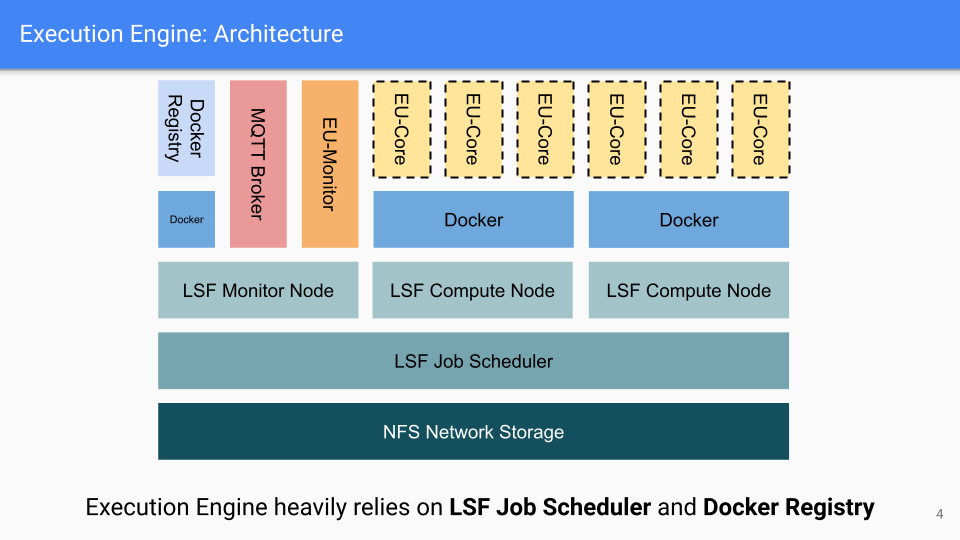
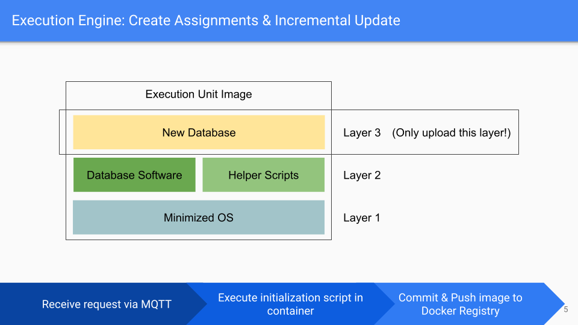

# SQLitz - Execution Engine

## Introduction

Execution Engine（下文简称EE）是SQLitz的分布式执行与评测SQL代码的引擎，主要具有以下特性：

- 高安全性：SQL代码在独立Docker容器中执行，完成评测后立刻销毁
- 分布式评测：借助IBM LSF作业管理系统实现集群监控，作业排队，节点调度，资源管理，以及容器的创建与销毁
- 增量式更新：本地Docker Registry存储以及在集群中分发Assignment镜像，并且不会多次保存和传输镜像中复用的Layer

